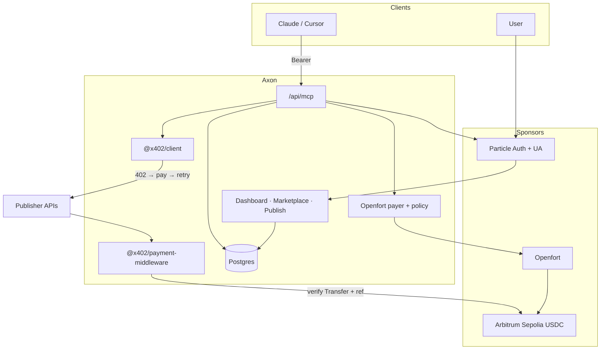
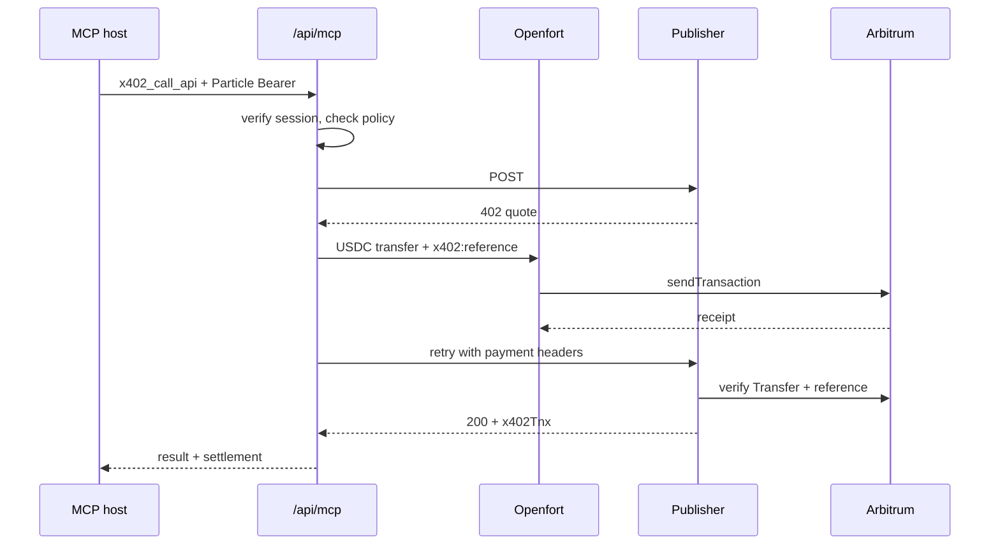

# Axon

I built Axon so AI agents can discover paid APIs, pay in USDC, and call them without me clicking approve on every request.

Developers publish pay-per-use endpoints to a marketplace. Agents find them through the web app or MCP, settle on Arbitrum, and get the result plus a transaction hash. Particle handles who you are. Openfort handles the spend wallet. Arbitrum is where the money lands.

How each sponsor is wired: [docs/axon-hackathon-integration.md](docs/axon-hackathon-integration.md).

## Why it exists

Agents already call tools. Paying for tools still assumes a human in the loop: API keys, subscriptions, wallet popups, gas. That breaks autonomy. Axon gives the agent a funded wallet under spending limits and runs the payment inside the tool call.

## What I built

**Marketplace** for anyone to list a priced API (URL, schema, USDC price). Agents browse it in the UI or via `x402_list_apis`.

**Publish** so API owners list their own endpoints. Settlement goes to the receiver on their x402 paywall. Axon discovers and pays; it does not custody publisher keys.

**Agent wallet + policy.** After Particle login, each user gets an Openfort backend wallet. Fund it with USDC, set per-call and per-day caps, turn on server signing. Caps run in Axon before Openfort signs. Gas uses an Openfort sponsorship policy so the agent path is not stuck waiting for ETH.

**MCP** at `/api/mcp` for Claude and Cursor. Particle Bearer required (`uuid:token`). Tools: `x402_list_apis`, `x402_call_api`. Paid responses include `x402Tnx` and land in the execution timeline.

**Dashboard** for agent address, balance, policy, history, and your listings.

I seed a couple of example APIs so a fresh install has something to call. They are demos. The real product is the marketplace rail; anyone can publish their own API.

## Architecture

One Next.js app: UI, APIs, MCP, paywalls. Postgres for users, listings, calls. Two packages so the client and the publisher speak the same x402 protocol.

## How a paid call works

No shared admin payer. Every MCP payment leaves that user’s Openfort agent wallet.

## How it fits together

**Auth.** Particle login → embedded wallet + session. Server checks `getUserInfo`, stores the user on `particle_user_id`. MCP without a Bearer gets 401.

**Two wallets.** Particle (and Universal Account) is identity and funding. Openfort is the spend engine for MCP. Settlement on the demo is Arbitrum Sepolia USDC through Openfort; UA covers the unified balance / chain-abstraction story on the Particle side.

**Payment.** Encode USDC `transfer`, append `x402:<reference>` in calldata, Openfort `sendTransaction` on `421614` with gas policy `pol_…`. Wait for receipt, then retry. Signing rules live in Openfort (`ply_…`); I do not pass those as the gas policy id.

**x402.** `@x402/client` does 402 → pay → retry. `@x402/payment-middleware` quotes, checks TTL/replay, verifies on-chain Transfer + reference, attaches `x402Tnx`. Publishers wrap their API; Axon MCP is the caller with the user’s payer.

**Data.** `users` (Particle, Openfort, policy), `apis` (listing), `api_calls` (amount, status, tx).

**Stack.** Next.js 15, React 19, Tailwind/shadcn, Postgres, Particle, Openfort, viem, MCP streamable HTTP.

## Sponsors

| | |
| --- | --- |
| Particle Auth | Login, wallet, Bearer for UI and MCP |
| Particle Universal Accounts | Unified balance; optional value toward spend |
| Openfort | Agent wallet, silent signing, gas sponsorship |
| Arbitrum | USDC settlement and verification |

More detail on the wiring: [docs/axon-hackathon-integration.md](docs/axon-hackathon-integration.md).

## Settlement

USDC on Arbitrum Sepolia · chain `421614` · [sepolia.arbiscan.io](https://sepolia.arbiscan.io) · token `0x75faf114eafb1BDbe2F0316DF893fd58CE46AA4d`

## Surface

| | |
| --- | --- |
| `/dashboard` | Wallet, policy, activity |
| `/marketplace` | Discover APIs |
| `/publish` | List an API |
| MCP Integration | Token + host config |
| `POST /api/mcp` | Agent tools |
| `POST /api/pay` · `GET /api/user/agent` · policy routes | Spend path |

## Try it

Sign in → fund the Openfort agent wallet → enable policy → paste MCP config into Claude or Cursor → `x402_list_apis` → `x402_call_api`. You should see `x402Tnx` and a row in history.

To publish your own: wrap with `@x402/payment-middleware`, list on Publish.
