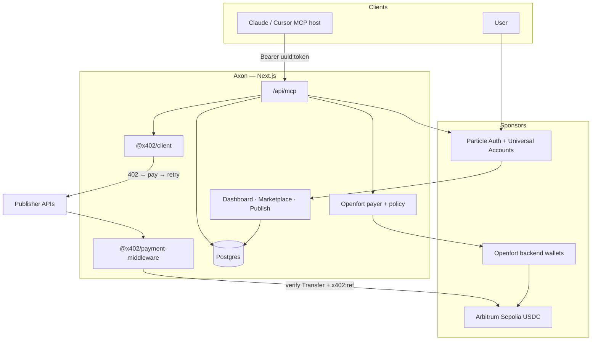
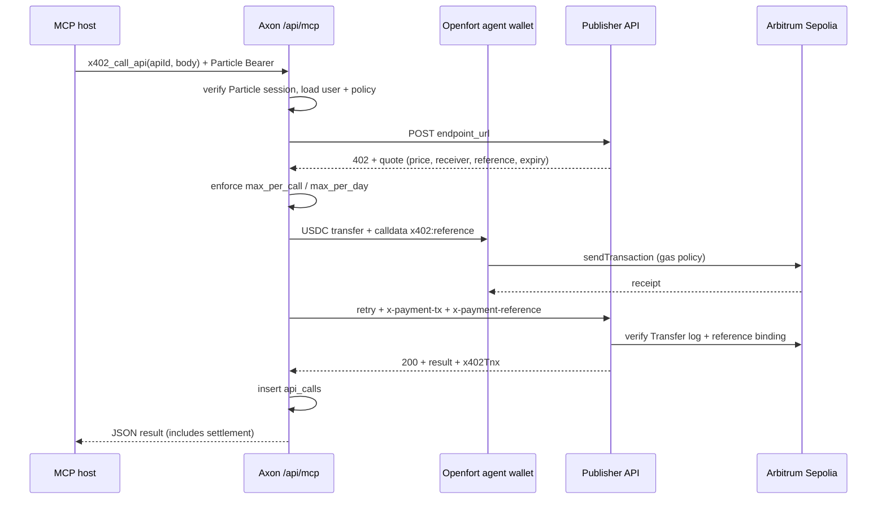

# Axon

Axon is the execution layer for autonomous AI agents.

Developers publish pay-per-use APIs to a marketplace. Agents discover those APIs, pay in USDC on Arbitrum, and call them without a human approving every request. Identity, spend policy, gas sponsorship, and settlement are wired so the agent can stay in the tool loop and keep working.

This repo is a working product: marketplace, publisher flow, dashboard, MCP server for Claude and Cursor, and on-chain settlement.

Sponsor wiring (Particle, Openfort, Arbitrum) is spelled out in [docs/axon-hackathon-integration.md](docs/axon-hackathon-integration.md).

## The problem

AI agents can already call tools. Paying for those tools is still human-shaped.

API keys and subscriptions assume an operator. Wallet popups break autonomous loops. Bridging and gas turn every call into ops work. Axon closes that gap: the agent discovers a priced API, pays from a dedicated agent wallet under user-set limits, and gets the response plus a transaction proof.

## Architecture

One deployable app owns the UI, authenticated APIs, MCP transport, and paywall helpers. Postgres holds users, listings, and call history. Shared packages implement the x402 client and server sides so publishers and Axon speak the same protocol.

## What we built

**Marketplace.** Public catalog of pay-per-use APIs (URL, price, chain, request/response schemas). Agents browse it in the web app or via MCP `x402_list_apis`.

**Publish.** API owners list endpoints on Axon. Settlement goes to the receiver configured in their own x402 paywall. Axon orchestrates discovery and payment; it does not hold publisher keys.

**Agent wallet and policy.** After Particle sign-in, Axon provisions an Openfort backend wallet per user. The user funds it with USDC, sets `max_per_call` / `max_per_day`, and enables server signing. Caps are enforced in Axon before Openfort is asked to sign. Gas for agent payments uses an Openfort sponsorship policy (`pol_…`), so the spend path is not blocked on native ETH UX.

**MCP.** Streamable HTTP at `/api/mcp`. Auth is required: Particle Bearer `uuid:token`. Tools: `x402_list_apis`, `x402_call_api`. Every successful paid call returns the API payload plus `x402Tnx` (`tnxHash`, `amount`, `token`) and is written to `api_calls` for the dashboard timeline.

**Dashboard.** Agent address, Sepolia USDC balance, spending policy controls, execution history, and owned listings.

Sample paid routes may ship in a seed database so a fresh deploy has something to call. They are example listings. The product is the marketplace and payment rail; any publisher can plug in their own API.

## Paid call path

There is no shared admin `PAYER_PRIVATE_KEY`. Every MCP payment is attributed to the authenticated user’s Openfort agent wallet.

## Technical detail

### Identity and auth

Particle Auth is the identity layer. Social / email login yields an embedded EVM wallet and a session pair (`uuid`, `token`). The client sends `Authorization: Bearer uuid:token` on dashboard APIs and MCP. The server verifies via Particle’s `getUserInfo` RPC, resolves the EVM address, and upserts `users` on `particle_user_id`. Unauthenticated MCP requests return 401.

### Two wallets

| Wallet | Owner | Role |
| --- | --- | --- |
| Particle Auth EOA (+ Universal Account) | User | Identity, session, funding UX, unified balance view |
| Openfort backend account | Axon-controlled spend | Signs USDC payments for MCP under policy |

Universal Accounts (EIP-7702 on the Particle address) support the chain-abstracted balance narrative and optional value movement. Marketplace settlement for the demo runs on Arbitrum Sepolia through Openfort so the autonomous pay loop is fully exercisable on testnet USDC.

### Openfort payment construction

On pay, Axon encodes a USDC `transfer(receiver, amount)`, concatenates hex `x402:<reference>` onto the calldata, and calls Openfort `accounts.evm.backend.sendTransaction` on chain id `421614`. Signing policies (`ply_…`) are configured in the Openfort project and evaluated automatically; the runtime gas sponsorship id passed into send is `pol_…`. Axon waits for the receipt before retrying the publisher.

### x402 packages

| Package | Responsibility |
| --- | --- |
| `@x402/client` | `createUsdcClient({ payer })`: detect 402, pay, retry with `x-payment-tx` / `x-payment-reference` |
| `@x402/payment-middleware` | Quote creation, TTL, replay store, on-chain Transfer verification, reference binding, `x402Tnx` on success. Express middleware and Fetch/Next helpers |

Publishers wrap their own endpoints with the middleware (receiver = where they earn). Axon’s MCP layer is the smart caller that owns the user’s Openfort payer.

### Data model

`users`: Particle id, wallet, Openfort account id/address, `server_signing_enabled`, `max_per_call`, `max_per_day`.  
`apis`: owner, name, description, `endpoint_url`, `price_per_call`, chain, sample request/response schemas, visibility.  
`api_calls`: user, api, amount, status, optional tx hash, timestamps.

### Stack

Next.js 15 App Router, React 19, Tailwind + shadcn/ui, Postgres (Supabase in production), Particle Auth + Universal Account SDK, Openfort Node SDK, viem for encoding/RPC, MCP TypeScript SDK (streamable HTTP).

## Sponsor map

| Piece | Role |
| --- | --- |
| Particle Auth | Login, embedded wallet, Bearer session for UI and MCP |
| Particle Universal Accounts | Unified balance view; optional cross-chain value toward spend |
| Openfort | Backend agent wallet, popup-free signing, gas sponsorship |
| Arbitrum | USDC settlement and verification surface |

Deeper architecture: [docs/axon-hackathon-integration.md](docs/axon-hackathon-integration.md).

## Settlement

USDC on **Arbitrum Sepolia**.

- Chain ID: `421614` (`eip155:421614`)
- Explorer: [sepolia.arbiscan.io](https://sepolia.arbiscan.io)
- USDC: `0x75faf114eafb1BDbe2F0316DF893fd58CE46AA4d` (6 decimals)

## Product surface

| Route / surface | Purpose |
| --- | --- |
| `/` | Landing + Particle Auth |
| `/dashboard` | Agent wallet, policy, activity |
| `/marketplace` | Discover public APIs |
| `/publish` | List a pay-per-use API |
| MCP Integration UI | Bearer token + host config |
| `POST /api/mcp` | MCP tools (`x402_list_apis`, `x402_call_api`) |
| `POST /api/pay` | Pay a quote from the agent wallet |
| `GET /api/user/agent` | Agent address, balance, policy |
| `POST /api/user/enable-server-signing` | Toggle policy |

## Try it

1. Sign in, fund the Openfort agent wallet with Sepolia USDC, enable a spending policy.
2. Open MCP Integration, paste the Bearer token and MCP URL into Claude or Cursor.
3. Run `x402_list_apis`, then `x402_call_api` against a listing. Confirm `x402Tnx` in the response and a row in execution history.

To publish: wrap your API with `@x402/payment-middleware`, set your receiver address, list it on Publish. Agents discover it the same way.
