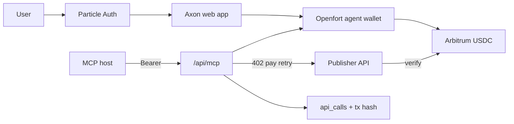

# Axon architecture and sponsor integration

This document explains how Axon is put together and what each sponsor contributes. It is the companion to the product README. There is no setup cookbook here; the goal is architecture.

## What Axon is

Axon is a marketplace and payment rail for AI agents. Publishers list pay-per-use APIs. Agents discover them through the web app or MCP, pay in USDC on Arbitrum, and receive results with on-chain proof. Users sign in once, fund an agent wallet, set spending limits, and let the agent operate under those limits.

## System shape

Everything ships as one Next.js application: UI, authenticated APIs, MCP server, and paywall helpers. Postgres stores users, published APIs, and call history. Two small packages implement the x402 client (402 → pay → retry) and the payment middleware (quote, verify, inject settlement metadata).

Outside the app sit Claude or Cursor as MCP clients, Particle for auth and account abstraction, Openfort for server-side agent payments, and Arbitrum for USDC settlement.

## Two wallets, one job

Each user has an identity wallet from Particle Auth and a spend wallet from Openfort.

**Particle Auth wallet.** This is who you are. It backs login, the Bearer session used by the dashboard and MCP, and optional funding transfers into the agent wallet. Particle Universal Accounts sit on this identity so the product can show a unified balance story and move value when mainnet liquidity is in play.

**Openfort agent wallet.** This is what spends. Axon provisions one backend wallet per user. MCP payments always leave this address. Spending policy (enabled flag, max per call, max per day) is enforced in Axon before Openfort is asked to sign. Gas for those payments is intended to be covered by an Openfort sponsorship policy so the agent path is not blocked on native gas UX.

The dashboard presents the agent wallet as the operational balance for MCP. That matches how settlement actually works on Arbitrum Sepolia.

## Particle Auth

Particle is the front door.

Users sign in with social or email flows. Particle issues an embedded EVM wallet and a session (`uuid` + `token`). Axon sends that pair as `Authorization: Bearer uuid:token` on protected routes and on MCP. The server verifies the session with Particle’s getUserInfo RPC, resolves the EVM address, and upserts the user in Postgres keyed by Particle user id.

Without a valid Particle session, MCP refuses the connection. There is no anonymous shared payer. Attribution and policy always belong to a real user.

## Particle Universal Accounts

Universal Accounts give Axon a chain-abstracted balance view on top of the Particle identity (EIP-7702 upgrade of the same address). The product uses this for “agent balance” style UX and for optional value movement toward the spend path.

Marketplace settlement runs on Arbitrum Sepolia through Openfort. Universal Accounts speak mainly to mainnet liquidity concepts in the SDK. The intentional split is: Particle for identity and unified balance narrative; Openfort plus Arbitrum Sepolia for the autonomous pay loop on testnet USDC.

## Openfort

Openfort is the autonomous spend engine.

On first need, Axon creates a backend EVM account for the user and stores the Openfort account id and address. When MCP must pay a quote, Axon builds a USDC transfer to the quote’s receiver, appends an `x402:<reference>` binding in calldata, and asks Openfort to send the transaction on Arbitrum with the project’s gas policy when configured. Axon waits for the receipt before treating the payment as settled.

Openfort’s role is not “another login.” It is server-side signing under Axon’s policy so agents never see a wallet popup mid-tool-call. Signing rules and sponsorship policies in the Openfort project gate what that wallet is allowed to do.

## Arbitrum

Arbitrum is where money moves.

Every successful paid marketplace call includes a USDC transfer on Arbitrum Sepolia to the receiver named in the x402 quote. The payment middleware verifies Transfer logs and the reference binding before unlocking the API response. Explorers and tx hashes in the UI and MCP output point at that chain.

Chain id `421614`, USDC at the Sepolia native USDC address used throughout the app. Amounts use six decimals.

## x402 payment protocol

Axon does not invent a private payment header story. It uses x402.

Publishers wrap their endpoints so unpaid requests return 402 with a quote (price, token, receiver, reference, expiry). Callers that already paid retry with transaction and reference headers. The middleware checks the chain, rejects replays and expired quotes, and attaches settlement metadata (`x402Tnx`) to successful JSON responses.

Axon’s MCP layer is a smart caller: it owns the user’s Openfort payer, runs the 402 loop, and records the call. Publishers keep control of their API and of the receiver address that earns USDC.

## MCP

The MCP server is a first-class product surface, not a side script.

Hosts connect over streamable HTTP to `/api/mcp` with the Particle Bearer. Tools expose marketplace discovery and paid invocation. Before tools run, Axon ensures the Openfort agent wallet exists. After a call, history in Postgres feeds the dashboard timeline so humans can audit what the agent spent.

## Marketplace vs sample APIs

The marketplace is open-ended. Any developer can publish an endpoint that speaks x402. Sample tools may appear in a fresh database so demos work without a third-party publisher. They are pointers, not the product thesis. The thesis is: publish once, get discovered by agents, get paid per call on Arbitrum.

## Data model (conceptually)

Users map Particle identity to an Openfort wallet and spending policy. APIs map an owner to a public listing (URL, price, chain, schemas). API calls map a user and listing to amount, status, and optional transaction hash. That is enough to power discovery, policy, and an execution feed.

## Design choices we care about

**Fail closed on auth and Openfort.** Missing Particle sessions and missing Openfort configuration do not fall back to a shared hot wallet.

**Policy before signature.** Caps are checked in Axon before Openfort is invoked.

**Reference-bound payments.** The on-chain memo ties a transfer to a specific quote so verification is not “any USDC to the receiver.”

**One deployable app.** Dashboard, MCP, and paywall helpers live together so the demo and production path stay the same shape (Vercel-friendly Next.js plus Postgres).

## Mapping sponsors to outcomes

| Outcome | Primary sponsor |
| --- | --- |
| Who is the user? | Particle Auth |
| How does the agent authenticate? | Particle session Bearer on MCP |
| Who signs autonomous payments? | Openfort backend wallet |
| Who pays gas for those payments? | Openfort sponsorship policy |
| Where does USDC settle? | Arbitrum |
| How is payment proven to the API? | x402 verify on Arbitrum logs + reference |

Together they form the Axon loop: identity, autonomous spend, settlement, proof, and agent distribution.
