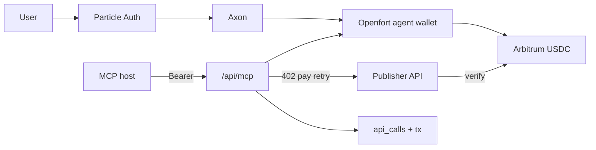

# Axon · Particle, Openfort, Arbitrum

I built Axon as a marketplace and payment rail for AI agents. You sign in once, fund an agent wallet, set spending limits, and let Claude or Cursor call paid APIs. Each call settles in USDC on Arbitrum and comes back with a proof. This page is how Particle, Openfort, and Arbitrum show up in that loop.

## Shape

One Next.js app holds the UI, MCP server, and paywall helpers. Postgres stores users, listings, and call history. `@x402/client` and `@x402/payment-middleware` own the 402 pay and verify path. Outside that: Particle for identity, Openfort for silent spend, Arbitrum for settlement.

## Two wallets

**Particle** is who you are: login, Bearer session (`uuid:token`), funding into the agent wallet, and Universal Accounts on the same address (EIP-7702) for a unified balance view.

**Openfort** is what spends: one backend wallet per user, created on first need. MCP payments always leave this address. I enforce `server_signing_enabled`, `max_per_call`, and `max_per_day` in Axon before asking Openfort to sign. Gas sponsorship uses a `pol_…` policy so the agent is not blocked on ETH.

The dashboard treats the Openfort balance as the operational MCP balance. That matches Sepolia settlement.

## Particle Auth

Social or email login → embedded EVM wallet + session. Axon sends `Authorization: Bearer uuid:token` on protected routes and MCP. The server verifies with Particle `getUserInfo`, resolves the wallet, upserts on `particle_user_id`. No session means MCP returns 401. There is no anonymous shared payer.

## Particle Universal Accounts

UA sits on the Particle identity for chain-abstracted balance UX and optional value movement toward spend. Marketplace settlement for the demo runs on Arbitrum Sepolia through Openfort (testnet USDC end to end). Particle owns identity and the unified balance story; Openfort + Arbitrum own the autonomous pay loop.

## Openfort

On first use I create a backend EVM account and store the id + address. On a 402 quote I build a USDC transfer to the quote receiver, append `x402:<reference>` in calldata, and `sendTransaction` on Arbitrum with the gas policy. I wait for the receipt before retrying the publisher.

Openfort is not a second login. It is server-side signing under my policy so the agent never hits a wallet popup mid-tool-call. Signing rules (`ply_…`) live in the Openfort project; gas sponsorship is the separate `pol_…` id.

## Arbitrum

Every successful paid call includes a USDC transfer on Arbitrum Sepolia to the quote receiver. The middleware verifies Transfer logs and the reference binding before unlocking the response. Chain `421614`, Sepolia USDC, six decimals. Tx hashes in the UI and MCP point here.

## x402

Publishers return 402 with price, token, receiver, reference, expiry. Paid retries send `x-payment-tx` and `x-payment-reference`. Middleware checks chain, TTL, replay, and on-chain proof, then attaches `x402Tnx`.

Axon MCP owns the user’s Openfort payer and runs that loop. Publishers keep their API and their receiver address.

## MCP

Streamable HTTP at `/api/mcp` with Particle Bearer. Tools list the marketplace and call by id. Before tools run I ensure the Openfort wallet exists. After a call, Postgres feeds the dashboard timeline.

## Marketplace

Anyone can publish an x402 endpoint. Seed listings exist so demos work out of the box; they are examples. The idea is publish once, get discovered by agents, get paid per call.

## Choices I made

Fail closed if Particle or Openfort is missing. No shared hot wallet. Policy before signature. Payments bound to a quote via `x402:<reference>`, not “any USDC to the receiver.” One app for dashboard, MCP, and paywalls so local and production stay the same shape.

## Who does what

| Outcome | Sponsor |
| --- | --- |
| Who is the user? | Particle Auth |
| How does the agent authenticate? | Particle Bearer on MCP |
| Who signs autonomous payments? | Openfort backend wallet |
| Who sponsors gas? | Openfort `pol_…` policy |
| Where does USDC settle? | Arbitrum |
| How is payment proven? | x402 verify on Arbitrum + reference |

Identity → autonomous spend → settlement → proof → agent distribution. That is the Axon loop.
